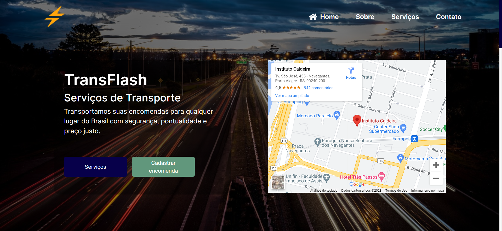

<h1 align="center"> Sistema Logístico </h1>

  Aplicação Web que gerencia o Sistema Logístico de uma empresa de entrega de encomendas 

  <a href="#-tecnologias">Tecnologias</a>&nbsp;&nbsp;&nbsp;|&nbsp;&nbsp;&nbsp;
  <a href="#-sobre-o-projeto">Sobre o Projeto</a>&nbsp;&nbsp;&nbsp;

  

## 🚀 Tecnologias

Esse projeto foi desenvolvido com as seguintes tecnologias:

- HTML
- CSS
- Javascript
- Bootstrap 5

## 💻 Sobre o Projeto

O projeto é uma aplicação web destinada ao gerenciamento do Sistema Logístico de uma empresa de entrega de encomendas, ao entrar você pode ver a Landing Page da empresa e um botão de Cadastrar Encomenda que leva você até a página de cadastro de encomendas, nessa página você pode cadastrar todas as suas encomendas e ao final clicar no botão de Otimizar, assim o sistema vai alocar as suas encomendas em nossos veículos e lhe apresentar todas as informações pertinentes a entrega.

- <a href="https://www.figma.com/file/7W64NlVFqwFvUbbbPWppYF/TransFlash?type=design&node-id=6%3A54&mode=design&t=ds2lcnOts3jSqiku-1">Link do Figma</a>